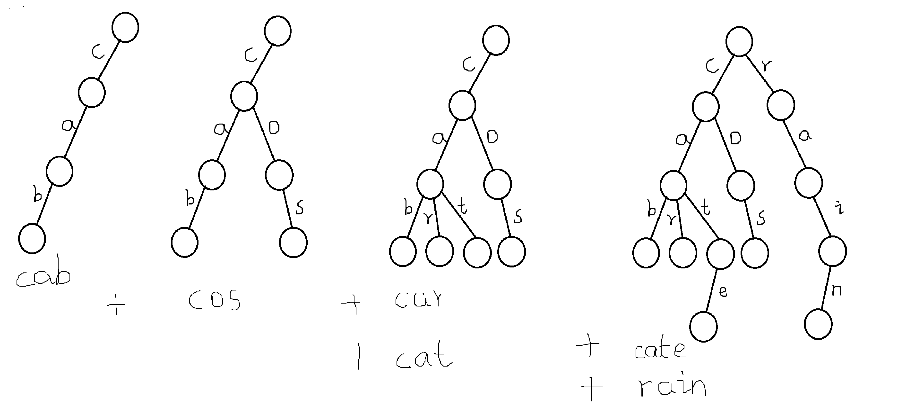

# 字典树

&emsp; $Trie$ 树，（~~字典树~~）是一种用于实现字符串快速检索的多叉树数据结构。$Trie$ 的每个节点都包含若干字符指针，若在插入或检索字符串的时候扫描到一个字符 $c$，就沿着当前节点的 $c$ 字符指针，走向指针指向的节点。

## $Trie$ 树的原理

&emsp; 假设 $cab, cos, car, cat, cate, rain$ 六个单词构建的 $Trie$ 树如图所示。

### $Trie$ 树的基本性质
1. 根节点不包含字符，除根结点外的每个节点只包含一个字符。
2. 从根节点到某个节点，路径上的字符连接起来，即为该结点所对应的字符。
3. 每个节点的子节点包含的字符都不相同。

&emsp; 对于每一个节点，从根节点遍历到它的路径就是一个单词，所该节点被标记则认为这个单词存在。

## $Trie$ 树的实现
### 1. 存储：
&emsp; $Trie$ 树的根节点编号为 $0$。其余每个结点的编号为从 $1$ 开始的正整数。用一个二维数组来保存所有节点。

&emsp; 用 $Trie[i][j]$ 来表示节点 $i$ 的第 $j$ 个根节点的编号。将小写字母按照字典序编号为 $0, 1, 2, 3, \cdots, 25$（~~代表 a ~ z~~）。$Trie[i][j] \neq 0$ 表示节点 $i$ 的第 $j$ 

&emsp; 其中 $Trie[i][0]$ 表示节点 $i$ 的子节点 $a$ 的编号。$Trie[i][1]$ 表示节点 $i$ 的子节点 $b$ 的编号。$Trie[i][2]$ 表示节点 $i$ 的子节点 $c$ 的编号。以此类推。

&emsp; 用 $size$ 表示字符集的大小，如果字符集全部为小写字母，$size = 26$。

&emsp; 用 $val[i]$ 存储节点 $i$ 附近的信息。例如一个字符串有一个权值就可以存在 $val[i]$ 里。

### 2.初始化
&emsp; 一颗 $Trie$ 树仅包含根节点，该结点指针指向空。

### 3.插入
&emsp; 当需要插入一个字符串 $S$ 是时候，我们另一个指针 $P$ 起初指向根节点，然后依次扫描 $S$ 中的每个字符 $c$：

&emsp; 1). 若 $P$ 的 $c$ 字符指针指向已经存在的节点 $Q$，则令 $P = Q$。从 $Q$ 继续向下插入下一个字符。

&emsp; 2). 若 $P$ 的 $c$ 字符指针指向空，则新建一个节点 $Q$，令 $P$ 的 $c$ 字符指针指向 $Q$，然后让 $P = Q$。

&emsp; 3). 当字符串 $S$ 扫描完毕时，在当前 $P$ 上标记它是一个字符串的结尾。

### 4. 检索
&emsp;  需要检索一个字符串 $S$ 在 $Trie$ 树中是否存在，我们另一个指针 $P$ 起初指向根节点，然后依次扫描 $S$ 中的每个字符 $c$：

&emsp; 1). 若 $P$ 的 $c$ 字符指针指向空，则说明 $Trie$ 树中没有 $S$。

&emsp; 2). 若 $P$ 的 $c$ 字符指针指向已经存在的节点 $Q$，则令 $P = Q$。从 $Q$ 继续向下检索。

&emsp; 3). 当 $S$ 中的字符扫描完毕时，若当前 $P$ 被标记为一个字符串的结尾则该字符串存在，否则不存在。

## $Trie$ 树的应用

1. 字符串检索，词频统计 
2. 字符串最长公共前缀 
   （~~对所有的串建立字典树。此时两个字符串的最长公共前缀的长度就是他们所在节点的公共祖先的个数，于是就可以用 LCA 来求解~~）
3. 排序 
    (~~按字典序输出所有 Trie 树中的字符串~~)
4. 作为其他数据结构的辅助结构 
    (~~AC 自动机，后缀树~~)

